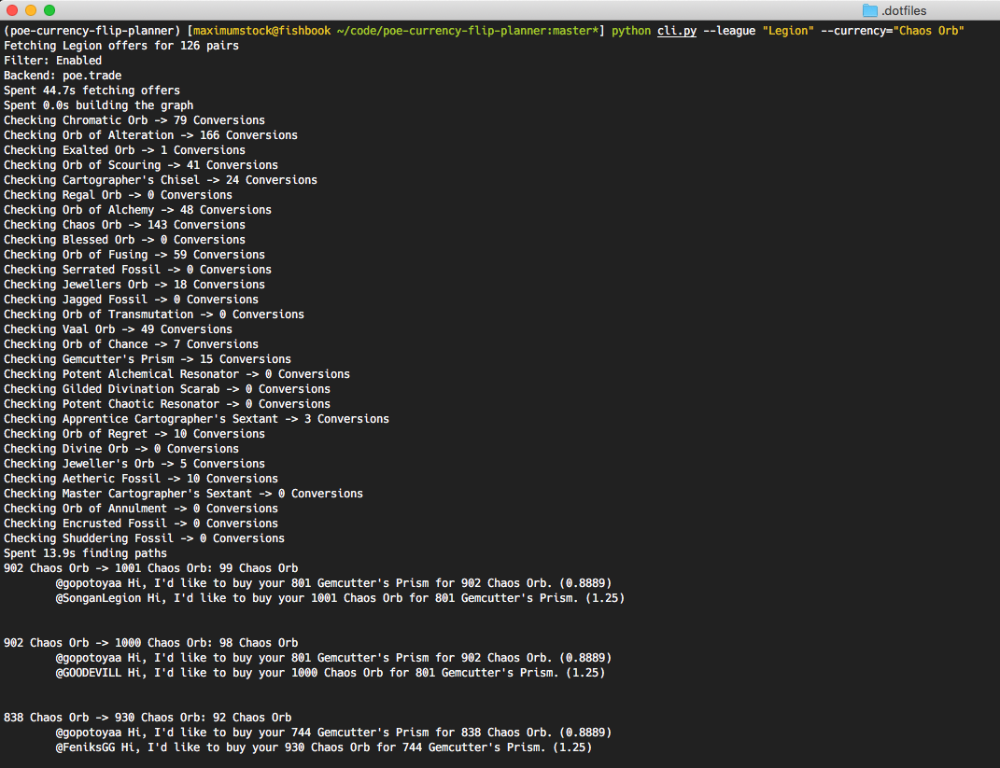

# poe-currency-flip-planner


[](https://opensource.org/licenses/MIT)
[](https://opensource.org/licenses/MIT)

A proof-of-concept finder for short-term arbitrage opportunities in
[Path of Exile](https://www.pathofexile.com).

## Overview

- [What exactly is this?](#what-exactly-is-this?)
- [How does it work?](#how-does-it-work?)
- [CLI Usage](#cli-usage)
  - [Installation](#installation)
  - [Configuration](#configuration)
- [Library Usage](#library-usage)
- [Contributing](#contributing)

## What exactly is this?

A command-line application that finds arbitrage opportunities by grabbing and
analysing data from [pathofexile.com/trade](https://pathofexile.com/trade/exchange).

For example, running `python cli.py --league Metamorph`
might result in something like:



**Note:** This tool does not support regular item gear but only currencies and
other bulk items. For simplicty I'll only use the term **items** from now on, but
refer to both currencies and other bulk items, such as Maps, Shards, Essences, etc.

## How does it work?

We start with a set of item pairs that we want to check trade offers
for, eg. sell `Chaos Orb`s for `Jagged Fossil`s.

By default, these item pairs are pre-defined and sort of data mined from
previous leagues (see [Data Analysis](data_analysis/README.md)).
You can also customize these pairs and various other details via a custom
configuration file, see Section [Configuration](#configuration).
The collected data is turned into a graph which gets traversed to find transaction
chains that yield profit.

## Installation

This tool requires Python >=3.7.
For installing dependencies, either use [poetry](https://python-poetry.org)
or regular Python 3 virtual environments, as described below.

1. Clone the respository: `git clone https://github.com/maximumstock/poe-currency-flip-planner.git`
1. Navigate into the project folder: `cd poe-currency-flip-planner`

### Via Poetry

Assuming `poetry` is installed:

1. Enter a new pipenv shell session: `poetry shell`
1. Install all dependencies: `poetry install`

### Via Python Virtual Environment

1. Enter a new shell session environment settings: `python3 -m venv env`
1. Activate your virtual environment: `source ./env/bin/activate`
1. Install all dependencies: `pip install -r requirements.txt`

## CLI Usage

Run via `python cli.py <OPTIONS>`, while in your virtual environment
or with pipenv active.

The CLI offers a few configuration flags.
You can always check them out via `python cli.py --help`.

```
> python cli.py --help
usage: cli.py [-h] [--league LEAGUE] [--currency CURRENCY] [--limit LIMIT]
              [--fullbulk] [--nofilter] [--debug]

CLI interface for PathFinder

optional arguments:
  -h, --help           show this help message and exit
  --league LEAGUE      League specifier, ie. 'Harvest', 'Hardcore Harvest'
                       or 'Flashback Event (BRE001)'. Defaults to 'Harvest'.
  --currency CURRENCY  Full name of currency to flip, ie. 'Cartographer's
                       Chisel, or 'Chaos Orb'. Defaults to all currencies.
  --limit LIMIT        Limit the number of displayed conversions. Defaults to
                       5.
  --fullbulk           Use all supported bulk items
  --nofilter           Disable item pair filters
  --debug              Enables debug logging
```

By default, we use [pathofexile.com/trade](https://pathofexile.com/trade/exchange), but
using [poe.trade](http://poe.trade) is possible.

Options `--fullbulk` and `--nofilter` bypass the configuration files and extend
the set of item pairs that is used to collect data for.
These options are not meant for end users but only relevant for collecting
extensive amount of data for the work in [Data Analysis](data_analysis/README.md).

## Configuration

The configuration file lets you define the following:

- Item Trading Paths
- Stock Requirements When Buying & Selling
- Trading Capital
- [Blacklisting Traders](#blacklisting-traders)

If you did not configure a custom configuration file, the default settings in
`config.default.json` are used.
Blacklisting traders is done separately.

The default configuration takes care for you of the first two points, but you
are free to customize.

### Example Trading Path Configuration

By default, we check prices for all item pairs specified in the respective config file.
You can also alter this to your liking to either remove or add trading paths.
In case you alter the configuration, please do so on a copy of the default configuration
file.

Here is an example excerpt with some explanatory notes.
In case of any problems or ambiguity, please open an issue.

```jsonc
{
  "version": 1, // Internal versioning - irrelevant for now
  "assets": {
    // These values act as a an optional upper limit on trading volume.
    // For example, limit all Chaos Orb trades to a start capital of 100.
    // Just a comfort feature so you don't have to manually calculate prices.
    "Chaos Orb": 100,
    "Exalted Orb": 5,
    "Chromatic Orb": 1000,
    "Orb of Fusing": 340
  },
  "trading": {
    "Chaos Orb": {
      // Default stock requirements when buying Chaos Orbs
      "minimum_stock": 40,
      "maximum_stock": 500,
      "sell_for": {
        // One entry per item you want to trade for your Chaos Orbs
        "Cartographer's Chisel": null,
        "Chromatic Orb": null,
        "Divine Orb": null
      }
    },
    "Exalted Orb": {
      // If we want to buy Exalted Orbs, we only consider
      // sellers with a stock between 1-100
      "minimum_stock": 1, // Defaults to 1
      "maximum_stock": 100, // Defaults to 0 (no limit)
      "sell_for": {
        "Cartographer's Chisel": null,
        // As there is no special config for Chaos Orbs,
        // we only consider sellers with a Chaos Orb stock
        // of 40-500
        "Chaos Orb": null,
        "Orb of Alteration": null,
        "Orb of Annulment": {
          // If we want to buy Annulment Orbs with Exalted Orbs, we only
          // consider sellers with a stock between 10-30.
          // This block overrides the default minimum_stock setting for
          // Orbs of Annulment when buying them with Exalted Orbs.
          "minimum_stock": 10,
          "maximum_stock": 30
        }
      }
    },
    "Orb of Annulment": {
      "minimum_stock": 5,
      "sell_for": {
        "Exalted Orb": 5
      }
    }
  }
}
```

### Blacklisting Traders

If you want to exclude certain traders you can do so by adding their account name
to your local `config/excluded_traders.txt` (one name per line).

## Library Usage

If you want to use this project as a library/dependency, feel free to use the
`PathFinder` class (see `src/pathfinder.py`) as an API.

The PathFinder class is a simple interface for finding profitable trade paths
for arbitrage.

All stages of data (eg. list of collected offers via the respective trading backend, the
constructed graph of offers and the found profitable paths) are part of each PathFinder
instance and can simply be accessed and used for further work.

I wrote a few simple unit tests to make the data fetching and parsing, graph
construction and traversal and path evaluation a bit more robust. You can run
those tests using predefined data structures via `python -m pytest tests`.
