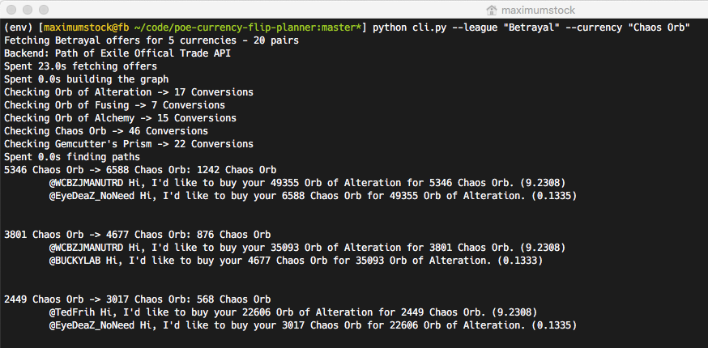

# poe-currency-flip-planner

This tool is an attempt at finding short-term arbitrage deals of currency in Path of Exile.

## Background
Via [poe.trade](http://currency.poe.trade) one can look for currently offered currency
conversion rates of other players. By indexing these conversion rates, it should be
possible to find a perfect chain of conversions between two preselected currencies that
yields the most arbitrage value at that point in time.

This data can be modeled as a graph where the currently available conversion rates are
single edges between nodes (currencies). Basically, this is the kind of data trade websites
such as [poe.trade](http://currency.poe.trade) show already.

Given a currency, circular paths of arbitrary length can be found within that graph that
describe different ways to trade the currency for different currencies `x` times until
trading back for the starting currency. Each of these paths yields one of the following
outcomes:

* You have the same amount as before
* You have less than before
* You have more than before

Comparing different paths up to an arbitrary depth results in an answer to the question
in which succession currencies have to be traded to yield different profits/losses.

## How it works
* Currency trade offers are collected from a backend provider, eg.
  * [poe.trade](http://poe.trade)
  * [Path of Exile Trade](https://www.pathofexile.com/trade/exchange)
* I currently use [Path of Exile Trade](https://www.pathofexile.com/trade/exchange) as a
  default, since they seem to automatically filter out certain price-fixing offers, which
  is really great!
* Alternatively you can use [poe.trade](http://poe.trade) which does not impose a rate-limit.
  With some tweaks you can then collect the offer data much faster, but it might contain
  price-fixing offers or otherwise corrupt information.
* Found trade offers are used to build a fully connected graph with currencies as nodes
  and one edge for each offer of each pair of non-identical currencies.
* The offered exchange rates and stocks are used to find the most profitable trading paths
  within the graph.

At the end, it might look something like this:

## Problems
* Exchange rates might not be online for long enough to complete complex transaction chains
* The supply/demand of both parties limits the number of paths that can be taken throughout
  the graph without collecting excess currency or investing additional currency to make
  up for the difference in trading volume between the parties.

  The simplest model assumes that at each step in the conversion chain the user is able
  to convert all currency that was acquired in the previous step

## Installation

I use Python >=3.5 for everything. I haven't tried running it with different versions.
You can install all dependencies by running `pip install -r requirements.txt`.

## How to use
`python cli.py` can be used as a CLI interface.
See `src/cli.py` or `python cli.py --help` for help
and options. This uses the official Path of Exile trading API per default.

After a while you will get a bunch of text printed out with your suggested
conversions.

If you want to use this project as a library/dependency, feel free to use the
`PathFinder` class (see `src/pathfinder.py`) as an API.

The PathFinder class is simply a static interface for finding proftiable trade
paths for arbitrage. You give it the league, a list of currencies and a backend
instace (eg. `backends/poeofficial.py`). For each
currency it starts looking for all profitable paths that start and end with that
currency, given a maximum transaction length (default: 3). All stages of data
(eg. list of collected offers via the respective trading backend, the constructed
graph of offers and the found profitable paths) are part of each PathFinder
instance and can simply be accessed and used for further work.

## Tests
I wrote a few simple unit tests to make the data fetching and parsing, graph
construction and traversal and path evaluation a bit more robust. You can run
those tests using predefined datastructures via `python -m pytest tests`.

## Data Exploration
The data that is used for the analysis is not part of this repository. Please
collect your own data. You can use `run_collector.sh` for this. It starts a
`PathFinder` instance (see `src/pathfinder.py`) for each league. I like running
this as a cronjob every 30 minutes. The collected PathFinder instances are then
pickled and persisted in their respective folders, specified in `run_collector.sh`.

See [here](data_analysis/README.md) for discussion.

### General Workflow (as of now)

1. Collect Data
  `PYTHONPATH=$(pwd) python data_analysis/collector.py --league "Delve" --path "data_analysis/raw/delve"`
2. Merge single `.pickle` files into one `merge.pickle`
  `PYTHON_PATH=$(pwd) python data_analysis/converter.py --path "data_analysis/raw/delve"`
3. Run analysis.py
  `PYTHONPATH=$(pwd) python data_analysis/analysis.py --path "data_analysis/raw/delve/merge.pickle"`

## Ideas & Roadmap
See [todo.org](todo.org) (beware of org-mode format from Emacs :)) for ideas, future features, etc. Feel free to send
me any feedback, either via email or PR.
