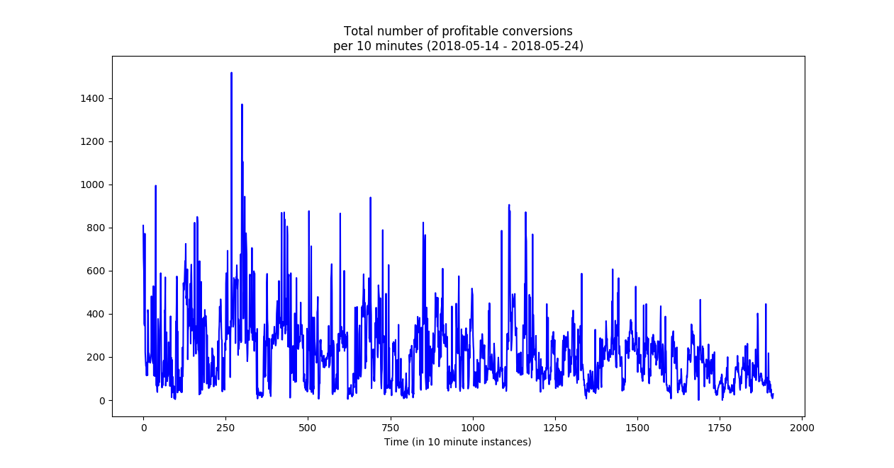
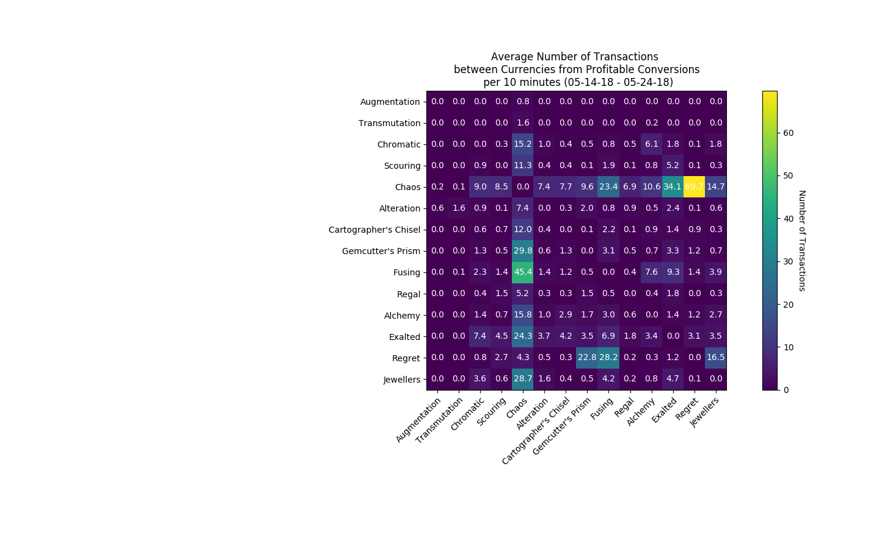

# Data Exploration

***Note: WIP!!!***

Everything I present in this section is very experimental and might be completely wrong. This is just something I enjoy personally without any formal affiliation to the topic of data science, so be nice and don't take anything too seriously.

With a working poe.trade crawler we can now collect currency trading data and try to gain some insights from it. In this section I'll try to document what I've tried to achieve this.

## Setup
I have collected currency trading information via this tool for a fixed set of currencies, about every ten minutes during `2018-05-14` until `2018-05-24`. 

The set of currencies was more or less consciously chosen. There are a lot of common and niche currencies I have not included, but the list for this test run was:

For each 2-permuation of currencies from the above list, I request trade offers from [poe.trade](http://poe.trade). For each list of offers, I filter out those who do not come with stock information, because this piece of information is important for constructing profitable trading paths, and then select the first five offers from these.

For the list of 14 currencies above this makes 182 permutations, 5 offers each, resulting in 910 offers at max. At this point I'd like to introduce `transaction` as a synonym for an offer from [poe.trade](http://poe.trade).

From this list of transactions, I construct a fully-meshed graph. For each currency from the above list, I start a breadth-first search to find all profitable trading paths (with a maximum length of 3 transactions) starting **AND** ending in that currency. So at the end of this I have 14 lists of profitable trading paths along this transaction graph. I call these trading paths `conversions`.

At this point I'd like to clarify that my definition of a conversion being **profitable** means that you have more of the respective currency after serially undertaking every transaction of the conversion. This means that the profitability of a conversion can solely rely on one of many transaction in the conversion. This is important to keep in mind for the heatmap visualization below. 

## Results
I have not done a whole lot yet, but here it is anyway.

### Number of proftiable conversions over time
The first plot is simply showing how many profitable conversion across all currency 2-permutations there were over time. The x-axis is a bit ugly as of now, but each data point simply resembles one snapshot, one every ten minutes.

### Currency importance for profitable conversions
So this should be the most interesting bit of data for now. Below you can see how often each 2-permutation transaction was found in a profitable conversion over the whole ten day dataset. Each number is calculated as `Number of proftiable conversions with that transaction` divided by `Number of snapshots`.

So we can see that selling `Orbs of Regret` for `Chaos Orbs` was especially often part of profitable conversions, averaging around 69 profitable conversions per snapshot. Keep in mind that this only means that there was a least one offer on [poe.trade](http://poe.trade) from `Orbs of Regret` to `Chaos Orbs` which ended up in a lot of conversions, which in turn ended up being profitable. It does not necessarily mean that there were a lot of offers from `Orbs of Regret` to `Chaos Orbs`.

As stated above, the maximum length of trading paths I evaluated was `3`, meaning three trades in a row, ending up at the starting currency, ie. trading `Exalted` -> `Regrets` -> `Chaos` -> `Exalted`. If the middle transaction is particularly profitable, the other two might be bad or average at best, but are improved by the middle one. At the same time, it does not mean that a certain transaction/2-permuation is especially profitable, but rather leads to a currency that itself offers more profitable transactions along the way.

We can also see that the matrix is relatively sparse, meaning only relatively few 2-permutations are often seen in profitable conversions. For example, all 2-permutations including `Orbs of Augmentation` or `Orbs of Transmutation` are basically non-existent when it comes to my method for finding proftiable conversions.

Generally speaking, selling and buying `Chaos Orbs` looks like the easiest way of making proftiable currency trades. This of course makes sense considering the significance of `Chaos Orbs` in everyday tades.
