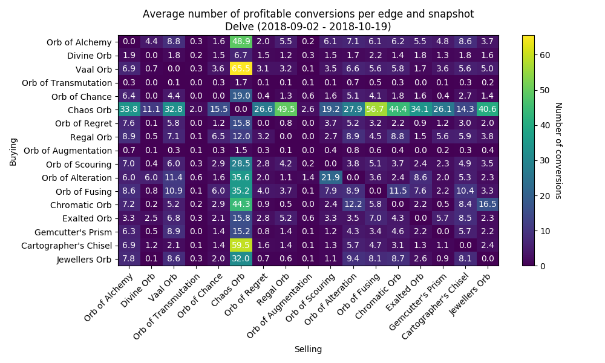
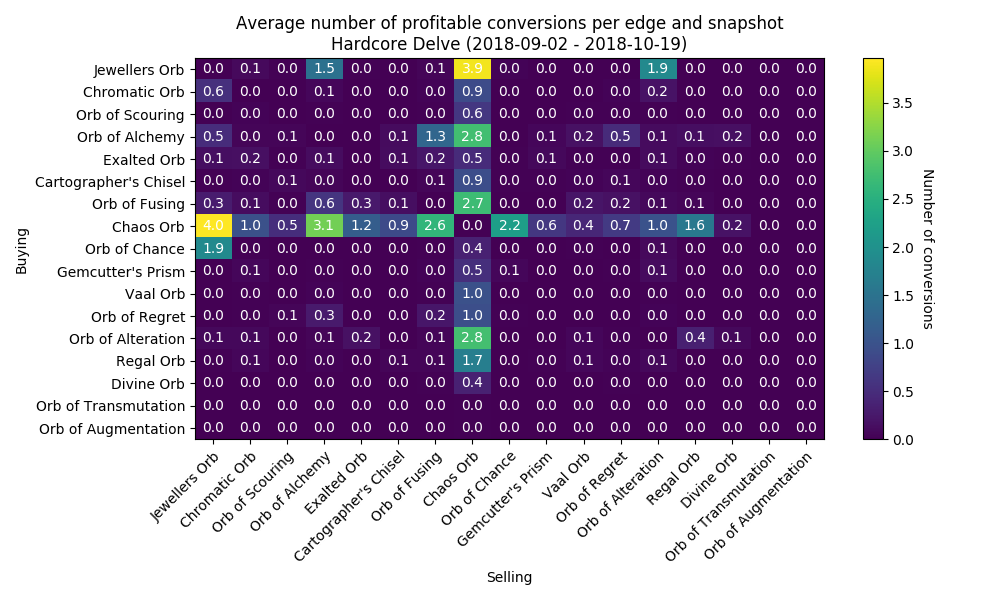
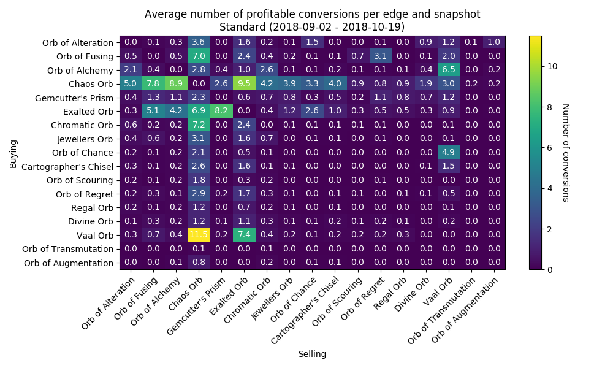

# Data Exploration

***Note: WIP!!!***

Everything I present in this section is very experimental and might be completely wrong. This is just something I enjoy personally without any formal affiliation to the topic of data science, so be nice and don't take anything too seriously.

With a working trade crawler we can now collect currency trading data and try to gain some insights from it. In this section I'll try to document what I've tried to achieve this.

## Setup
I have collected currency trading information via this tool for a fixed set of currencies, about every thirty minutes during the time the Delve leagues were active.
This leaves me with regular snapshots for the time between `2018-09-02` until `2018-10-19` for the leagues `Delve`, `Hardcore Delve`, `Standard` and `Hardcore`.

The set of currencies was more or less consciously chosen. There are a lot of common and niche currencies I have not included, but the list for this test run was:

* Cartographer's Chisel
* Chaos Orb
* Chromatic Orb
* Divine Orb
* Exalted Orb
* Gemcutter's Prism
* Jeweller's Orb
* Orb of Alchemy
* Orb of Alteration
* Orb of Augmentation
* Orb of Chance
* Orb of Fusing
* Orb of Regret
* Orb of Scouring
* Orb of Transmutation
* Regal Orb
* Vaal Orb

For each 2-permutation of currencies from the list above, I request trade offers
from [poe.trade](http://poe.trade).
For each list of offers, I filter out those who do not come with stock
information, because this piece of information is important for constructing
profitable trading paths, and then select the first five offers from these.

For the list of 17 currencies above this makes 272 permutations, 5 offers each,
resulting in 1360 offers at max.
I'll call these `transactions`.

From this list of transactions, I construct a fully-meshed graph.
For each currency from the above list, I start a breadth-first search to find
all profitable trading paths (with a maximum length of 3 transactions) starting
**AND** ending in that currency.
So at the end of this I have 17 lists of profitable trading paths along this
transaction graph. I call these trading paths `conversions`.

A conversion is considered `profitable` if you have more of the respective
currency after serially undertaking every transaction of the conversion.
This means that the profitability of a conversion can solely rely on one of
many transaction in the conversion.
This is important to keep in mind for the heatmap visualization below.

## Importance of currencies for profitable conversions
So this should be the most interesting bit of data for now.
Below you can see how often each 2-permutation transaction was found in a
profitable conversion.
Each number is calculated as the `total number of profitable conversions for that transaction over all snapshots`
divided by `number of snapshots`.
This is a simply relative metric to determine which transactions are most important.
The higher the number, the more profitable conversions were dependent on
transactions between those two currencies.
Below are heatmap visualizations for each league during the Delve season.

### Delve

### Hardcore Delve

### Standard

### Hardcore

So we can see that selling `Chaos Orbs` for `Vaal Orbs` in `Delve` was especially often part of profitable conversions, averaging around 65 profitable conversions per snapshot. Keep in mind that this only means that there was a least one offer from `Chaos Orbs` to `Vaal Orbs` which ended up in a lot of conversions, which in turn ended up being profitable. It does not necessarily mean that there were a lot of offers from `Chaos Orbs` to `Vaal Orbs`.

As stated above, the maximum length of trading paths I evaluated was `3`, meaning three trades in a row, ending up at the starting currency, ie. trading `Exalted` -> `Regrets` -> `Chaos` -> `Exalted`. If the middle transaction is particularly profitable, the other two might be bad or average at best, but are improved by the middle one. At the same time, it does not mean that a certain transaction/2-permuation is especially profitable, but rather leads to a currency that itself offers more profitable transactions along the way.

We can also see that the matrix is relatively sparse, meaning only relatively few 2-permutations are often seen in profitable conversions. For example, all 2-permutations including `Orbs of Augmentation` or `Orbs of Transmutation` are basically non-existent when it comes to my method for finding profitable conversions.

Generally speaking, selling and buying `Chaos Orbs` looks like the easiest way of making profitable currency trades. This of course makes sense considering the significance of `Chaos Orbs` in everyday trades.
